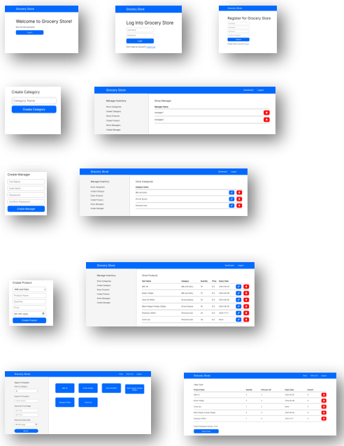

# Grocery Store
It is a multi-user app(admin/store manager/other users) used for buying and selling groceries. 

# Overview 
This project uses a stack of technologies and frameworks to create a dynamic and user-friendly web application. It utilizes the potential of Flask, HTML, Jinja2, CSS, SQLite, SQLAlchemy, and additional technologies to provide a seamless user experience. <br><br>
The app enable the user to buy many products from one or multiple categories. Store manager and admins can add categories and products. Admins can add, view and delete managers.

# Running 
Run the `app.py` file.
```
python app.py 
```

# Screenshots


# Requirements
